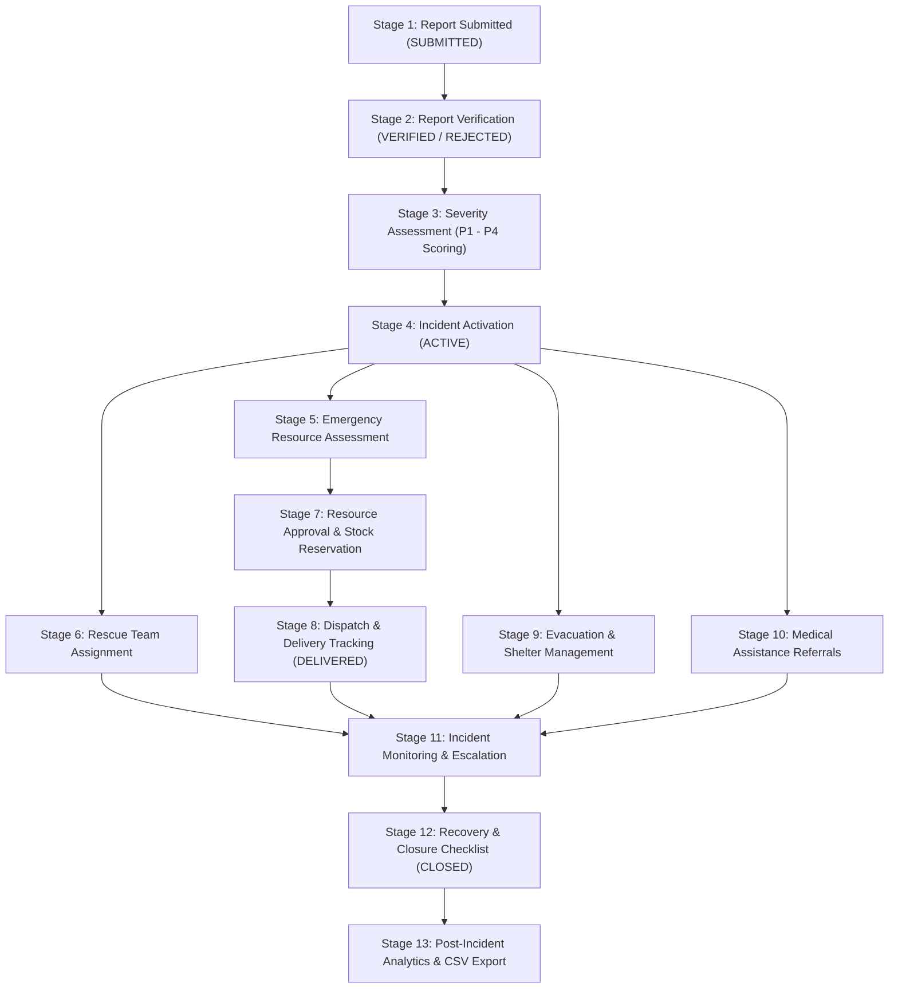

# Urban Disaster Relief and Resource Management System (UDRRMS)

[](https://fastapi.tiangolo.com)
[](https://react.dev)
[-F80000?logo=oracle&logoColor=white)](https://www.oracle.com/database/)
[-brightgreen)](docs/TEST_RESULTS.md)

An enterprise-grade, event-driven multi-agency disaster operations management system designed for urban emergency coordination. Built around a **strict 13-stage sequential response workflow** from initial citizen emergency reporting through incident verification, severity assessment, rescue squad dispatch, transactional inventory allocation, shelter placement, and audit-verified incident closure.

---

## 1. System Architecture & Tech Stack

- **Frontend:** React.js 18 with TypeScript, Tailwind CSS, Leaflet + OpenStreetMap spatial visualization, Recharts operational analytics.
- **Backend:** Python FastAPI with asynchronous RESTful endpoints, Pydantic v2 data validation, and JWT RBAC authentication.
- **Database Engine:** Oracle Database 21c/XE (Target Production) with normalized relational schema in **Third Normal Form (3NF)**.
- **Development Adapter:** Dynamic SQLite fallback adapter (`sqlite:///./udrrms.db`) enabling rapid zero-dependency local development without altering the Oracle logical design.
- **Security & RBAC:** Argon2/Bcrypt password hashing, tamper-proof JWT tokens with role claims, database transaction isolation, and immutable audit ledgers.

---

## 2. Three Main User Roles

| Role Persona | Target Credentials | Core Responsibilities |
|---|---|---|
| **Role 1: Citizen / Affected Person** (`CITIZEN`) | `citizen@udrrms.com`<br>`password123` | • Submit emergency incident reports with map coordinates.<br>• Input affected count, trapped individuals, and urgent medical needs.<br>• Receive unique Incident Reference ID (`RPT-...`).<br>• Real-time timeline tracking (`SUBMITTED` &rarr; `CLOSED`).<br>• Request rations, potable water, medical triage, or shelter places.<br>• Confirm assistance receipt or flag unresolved emergencies. |
| **Role 2: Disaster Management Officer** (`DISASTER_OFFICER`) | `officer@udrrms.com`<br>`password123` | • Review incoming reports in the Verification Queue.<br>• Verify reports or reject with mandatory audit reasons.<br>• Merge duplicate citizen alerts into active operational incidents.<br>• Run explainable rule-based severity scoring (P1-P4) with authorized overrides.<br>• Deploy and track tactical rescue squads (`ASSIGNED` &rarr; `COMPLETED`).<br>• Enforce mandatory closure criteria matrix before marking `CLOSED`. |
| **Role 3: Relief & Resource Coordinator** (`COORDINATOR`) | `coordinator@udrrms.com`<br>`password123` | • Manage multi-depot warehouse inventories (Hebbal, Manyata, Yelahanka).<br>• Review incident supply requests in the approval queue.<br>• Approve full/partial quantities and execute transactional stock reservations.<br>• Create transport convoy dispatches (`DSP-...`).<br>• Record delivery receipts with receiver identity and damaged quantity auditing.<br>• Monitor low-stock alerts and initiate replenishment orders. |

---

## 3. Mandatory Sequential 13-Stage Workflow



---

## 4. 27 Normalized Relational Tables (3NF Schema)

The database schema is organized into 27 tables with primary keys, foreign keys, unique constraints, and check constraints:

1. `USER_ACCOUNT` — Identity and hashed credentials.
2. `ROLE` — RBAC definitions (`CITIZEN`, `DISASTER_OFFICER`, `COORDINATOR`).
3. `AGENCY` — Emergency agencies (NDRF, SDRF, EMS, Fire & Emergency, Red Cross).
4. `CITIZEN` — Citizen residential profiles and emergency contacts.
5. `AFFECTED_PERSON` — Dependents declared by citizens.
6. `DISASTER_LOCATION` — Spatial hazard nodes, wards, coordinates, and risk zones.
7. `DISASTER_REPORT` — Citizen incident submissions with unique Reference IDs.
8. `DISASTER` — Operational command incidents (`INC-...`).
9. `REPORT_ATTACHMENT` — Supporting photographic evidence.
10. `REPORT_UPDATE` — Supplementary notes logged by citizens.
11. `RESPONSE_TEAM` — Tactical rescue teams and specializations.
12. `TEAM_ASSIGNMENT` — Operational mission assignments and lifecycles.
13. `RESOURCE` — Relief items catalog (Boats, Oxygen, Food, Water, Blankets).
14. `WAREHOUSE` — Regional supply depots and storage capacities.
15. `INVENTORY` — Available vs reserved stock balances per depot.
16. `RESOURCE_REQUEST` — Incident material demand requests.
17. `REQUEST_ITEM` — Items specified in supply requests.
18. `RESOURCE_ALLOCATION` — Approved reservations linked to depots.
19. `DELIVERY` — Transport convoy dispatches and tracking.
20. `DELIVERY_ITEM` — Quantities loaded and verified at delivery.
21. `SHELTER` — Municipal relief camps with capacity constraints.
22. `SHELTER_REGISTRATION` — Citizen shelter check-ins and check-outs.
23. `HOSPITAL` — Medical centers with ICU and general bed counters.
24. `MEDICAL_REFERRAL` — Patient trauma referrals.
25. `NOTIFICATION` — In-app alerts delivered to operators.
26. `INCIDENT_WORKFLOW_EVENT` — Immutable sequential workflow state events.
27. `AUDIT_LOG` — System-wide security and operations ledger.

---

## 5. Local Setup & Execution Instructions

### Prerequisites
- Python 3.10+
- Node.js 18+ and npm
- (Optional) Oracle Database 21c XE (or use default SQLite dev adapter)

### Quick One-Click Startup (Windows)
Double-click `RUN_UDRRMS.bat` in the project root directory. This script:
1. Starts the FastAPI backend service on port 8000.
2. Starts the React Vite frontend service on port 3000.
3. Automatically launches the browser at `http://localhost:3000/#/login`.

### Manual Startup

#### Step 1: Start Backend (FastAPI)
```bash
cd backend_py
pip install -r requirements.txt
python -m uvicorn app.main:app --host 127.0.0.1 --port 8000 --reload
```
- Interactive Swagger UI: `http://127.0.0.1:8000/docs`
- Interactive ReDoc: `http://127.0.0.1:8000/redoc`

#### Step 2: Start Frontend (React)
```bash
cd frontend
npm install
npm run dev
```
- Access Frontend UI: `http://localhost:3000/#/login`

---

## 6. Running the Automated Test Suite

To run all 14 automated test cases validating the 13 workflow stages and database constraints:

```bash
cd backend_py
python -m unittest tests/test_workflow.py
```

Result:
```text
Ran 14 tests in 0.428s
OK (100% pass rate)
```

---

## 7. Deliverables & Documentation Directory

- **ER Diagram:** [`docs/ER_DIAGRAM_UDRRMS.md`](docs/ER_DIAGRAM_UDRRMS.md)
- **Use-Case Diagram:** [`docs/USE_CASE_DIAGRAM.md`](docs/USE_CASE_DIAGRAM.md)
- **Sequence Diagram:** [`docs/SEQUENCE_DIAGRAM.md`](docs/SEQUENCE_DIAGRAM.md)
- **REST API Specs:** [`docs/API_DOCUMENTATION_UDRRMS.md`](docs/API_DOCUMENTATION_UDRRMS.md)
- **Test Results Log:** [`docs/TEST_RESULTS.md`](docs/TEST_RESULTS.md)
- **Oracle DDL Schema:** [`database/01_udrrms_oracle_schema.sql`](database/01_udrrms_oracle_schema.sql)
- **Oracle Seed Data:** [`database/02_udrrms_oracle_seed_data.sql`](database/02_udrrms_oracle_seed_data.sql)
- **Analytical SQL Queries:** [`database/03_analytical_queries.sql`](database/03_analytical_queries.sql)
