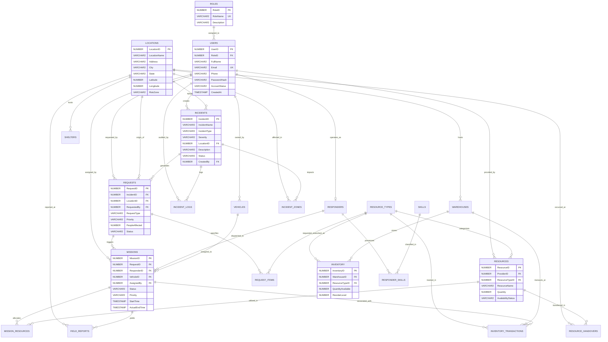

# UDR-ORP — Entity Relationship (ER) Diagram & Architecture

The **Urban Disaster Response & Resource Orchestration Platform (UDR-ORP)** relational model consists of 22 normalized tables designed to at least 3NF.

## Mermaid Entity-Relationship Diagram

## Cardinality & Multiplicity Matrix

| Relationship | Type | Parent Entity | Child Entity | Foreign Key Column |
|---|---|---|---|---|
| Role Assignment | 1 : N | ROLES | USERS | `RoleID` |
| Incident Origination | 1 : N | USERS | INCIDENTS | `CreatedBy` |
| Epicenter Location | 1 : N | LOCATIONS | INCIDENTS | `LocationID` |
| Multi-Zone Impact | M : N | INCIDENTS, LOCATIONS | INCIDENT_ZONES | `IncidentID`, `LocationID` |
| Emergency Request | 1 : N | INCIDENTS | REQUESTS | `IncidentID` |
| Request Resource Item | 1 : N | REQUESTS | REQUEST_ITEMS | `RequestID` |
| Resource Categorization | 1 : N | RESOURCE_TYPES | RESOURCES | `ResourceTypeID` |
| Warehouse Stocking | M : N | WAREHOUSES, RESOURCE_TYPES | INVENTORY | `WarehouseID`, `ResourceTypeID` |
| Mission Dispatch | 1 : N | REQUESTS | MISSIONS | `RequestID` |
| Tactical Assignment | 1 : N | RESPONDERS | MISSIONS | `ResponderID` |
| Mission Assets | M : N | MISSIONS, RESOURCES | MISSION_RESOURCES | `MissionID`, `ResourceID` |
| Field Reports | 1 : N | MISSIONS | FIELD_REPORTS | `MissionID` |
