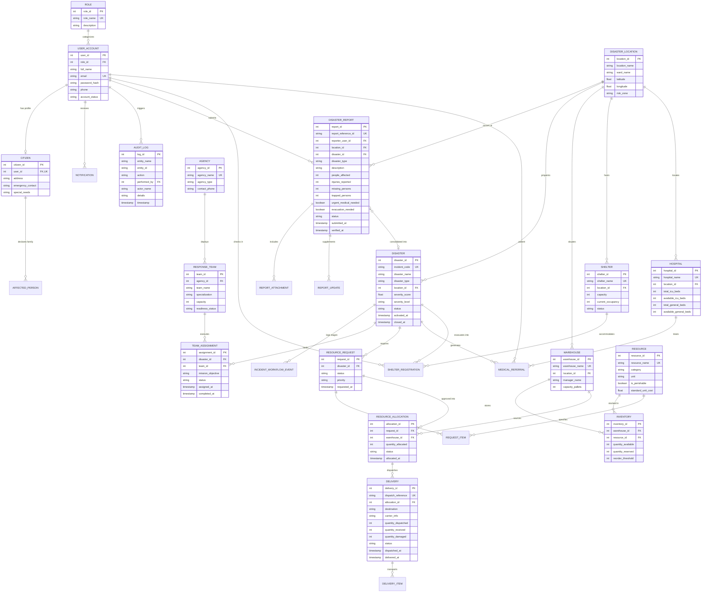

# Urban Disaster Relief and Resource Management System (UDRRMS)
## Entity-Relationship Diagram (27 Normalized Tables in 3NF)

### Table Normalization Rationale (3NF Compliance)
1. **Separation of Report and Operational Incident**: Citizens submit individual reports (`DISASTER_REPORT`). Multiple reports from nearby callers are merged into a single operational incident (`DISASTER`), avoiding data duplication while preserving complete reporting histories and caller identities.
2. **Transaction Isolation in Inventory**: Warehouse inventory (`INVENTORY`) separates `quantity_available` from `quantity_reserved`. When an allocation is approved, quantities move transactionally between available and reserved balances without double-allocation.
3. **Audit Immutability**: All stage transitions generate permanent event rows in `INCIDENT_WORKFLOW_EVENT` and `AUDIT_LOG` with foreign key actors, timestamps, and justification reasons.
