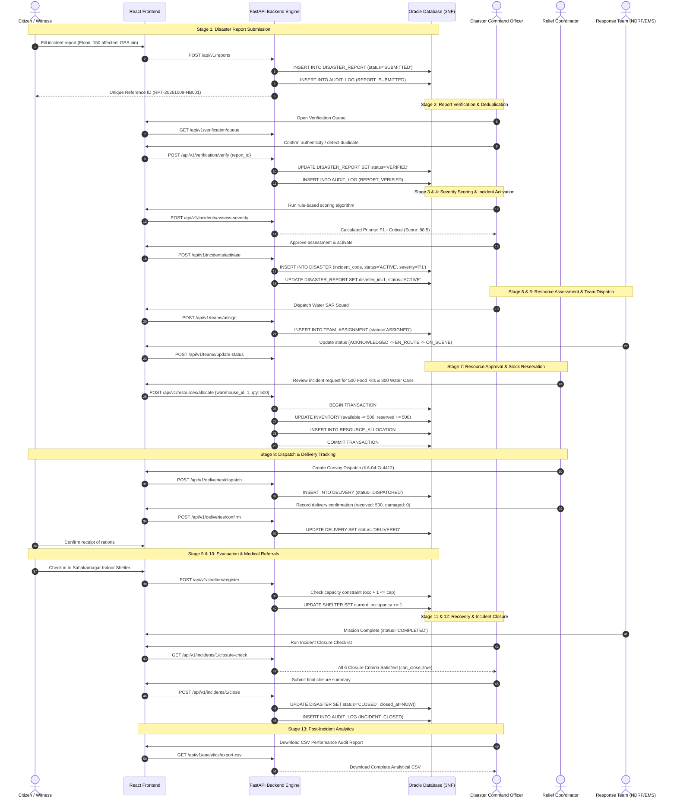

# UDRRMS Sequential Disaster Response Workflow
## End-to-End Sequence Diagram (13 Stages)

```mermaid
sequenceDiagram
    autonumber
    actor Citizen as Citizen / Witness
    participant Web as React Frontend
    participant API as FastAPI Backend Engine
    participant DB as Oracle Database (3NF)
    actor Officer as Disaster Command Officer
    actor Coordinator as Relief Coordinator
    actor Team as Response Team (NDRF/EMS)

    %% Stage 1
    Note over Citizen, DB: Stage 1: Disaster Report Submission
    Citizen->>Web: Fill incident report (Flood, 150 affected, GPS pin)
    Web->>API: POST /api/v1/reports
    API->>DB: INSERT INTO DISASTER_REPORT (status='SUBMITTED')
    API->>DB: INSERT INTO AUDIT_LOG (REPORT_SUBMITTED)
    API-->>Citizen: Unique Reference ID (RPT-20261009-HB001)

    %% Stage 2
    Note over Officer, DB: Stage 2: Report Verification & Deduplication
    Officer->>Web: Open Verification Queue
    Web->>API: GET /api/v1/verification/queue
    Officer->>Web: Confirm authenticity / detect duplicate
    Web->>API: POST /api/v1/verification/verify {report_id}
    API->>DB: UPDATE DISASTER_REPORT SET status='VERIFIED'
    API->>DB: INSERT INTO AUDIT_LOG (REPORT_VERIFIED)

    %% Stage 3 & 4
    Note over Officer, DB: Stage 3 & 4: Severity Scoring & Incident Activation
    Officer->>Web: Run rule-based scoring algorithm
    Web->>API: POST /api/v1/incidents/assess-severity
    API-->>Officer: Calculated Priority: P1 - Critical (Score: 88.5)
    Officer->>Web: Approve assessment & activate
    Web->>API: POST /api/v1/incidents/activate
    API->>DB: INSERT INTO DISASTER (incident_code, status='ACTIVE', severity='P1')
    API->>DB: UPDATE DISASTER_REPORT SET disaster_id=1, status='ACTIVE'

    %% Stage 5 & 6
    Note over Officer, Team: Stage 5 & 6: Resource Assessment & Team Dispatch
    Officer->>Web: Dispatch Water SAR Squad
    Web->>API: POST /api/v1/teams/assign
    API->>DB: INSERT INTO TEAM_ASSIGNMENT (status='ASSIGNED')
    Team->>Web: Update status (ACKNOWLEDGED -> EN_ROUTE -> ON_SCENE)
    Web->>API: POST /api/v1/teams/update-status

    %% Stage 7
    Note over Coordinator, DB: Stage 7: Resource Approval & Stock Reservation
    Coordinator->>Web: Review incident request for 500 Food Kits & 800 Water Cans
    Web->>API: POST /api/v1/resources/allocate {warehouse_id: 1, qty: 500}
    API->>DB: BEGIN TRANSACTION
    API->>DB: UPDATE INVENTORY (available -= 500, reserved += 500)
    API->>DB: INSERT INTO RESOURCE_ALLOCATION
    API->>DB: COMMIT TRANSACTION

    %% Stage 8
    Note over Coordinator, Citizen: Stage 8: Dispatch & Delivery Tracking
    Coordinator->>Web: Create Convoy Dispatch (KA-04-G-4412)
    Web->>API: POST /api/v1/deliveries/dispatch
    API->>DB: INSERT INTO DELIVERY (status='DISPATCHED')
    Coordinator->>Web: Record delivery confirmation (received: 500, damaged: 0)
    Web->>API: POST /api/v1/deliveries/confirm
    API->>DB: UPDATE DELIVERY SET status='DELIVERED'
    Citizen->>Web: Confirm receipt of rations

    %% Stage 9 & 10
    Note over Citizen, DB: Stage 9 & 10: Evacuation & Medical Referrals
    Citizen->>Web: Check in to Sahakarnagar Indoor Shelter
    Web->>API: POST /api/v1/shelters/register
    API->>DB: Check capacity constraint (occ + 1 <= cap)
    API->>DB: UPDATE SHELTER SET current_occupancy += 1

    %% Stage 11 & 12
    Note over Officer, DB: Stage 11 & 12: Recovery & Incident Closure
    Team->>Web: Mission Complete (status='COMPLETED')
    Officer->>Web: Run Incident Closure Checklist
    Web->>API: GET /api/v1/incidents/1/closure-check
    API-->>Officer: All 6 Closure Criteria Satisfied (can_close=true)
    Officer->>Web: Submit final closure summary
    Web->>API: POST /api/v1/incidents/1/close
    API->>DB: UPDATE DISASTER SET status='CLOSED', closed_at=NOW()
    API->>DB: INSERT INTO AUDIT_LOG (INCIDENT_CLOSED)

    %% Stage 13
    Note over Officer, Web: Stage 13: Post-Incident Analytics
    Officer->>Web: Download CSV Performance Audit Report
    Web->>API: GET /api/v1/analytics/export-csv
    API-->>Officer: Download Complete Analytical CSV
```
