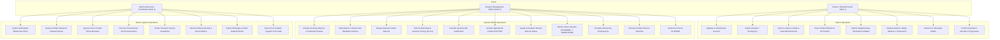

# UDRRMS Use-Case Specifications & Architecture

## System Use-Case Diagram

```mermaid
graph TD
    %% Actors
    subgraph Actors
        C["Citizen / Affected Person (Role 1)"]
        O["Disaster Management Officer (Role 2)"]
        R["Relief & Resource Coordinator (Role 3)"]
    end

    %% Citizen Use Cases
    subgraph "Citizen Operations"
        UC_C1["Register & Authenticate Account"]
        UC_C2["Report Disaster / Emergency"]
        UC_C3["Select Location on Map & Input Affected Count"]
        UC_C4["Track Incident Reference ID Timeline"]
        UC_C5["Submit Supplementary Information Updates"]
        UC_C6["Request Rations, Water, Medical, or Evacuation"]
        UC_C7["Check-In to Municipal Shelter"]
        UC_C8["Confirm Assistance Receipt or Flag Issues"]
    end

    %% Officer Use Cases
    subgraph "Disaster Officer Operations"
        UC_O1["Review Incoming Reports in Verification Queue"]
        UC_O2["Verify Report or Reject with Mandatory Reason"]
        UC_O3["Merge Duplicate Citizen Reports"]
        UC_O4["Perform Rule-Based Severity Scoring (P1-P4)"]
        UC_O5["Override Severity with Justification"]
        UC_O6["Activate Operational Incident (ACTIVE)"]
        UC_O7["Assign & Dispatch Tactical Rescue Teams"]
        UC_O8["Monitor Team Lifecycle (ASSIGNED -> COMPLETED)"]
        UC_O9["Escalate Worsening Emergencies"]
        UC_O10["Execute Incident Closure Checklist"]
        UC_O11["Authorize Closure (CLOSED)"]
    end

    %% Coordinator Use Cases
    subgraph "Relief Logistics Operations"
        UC_R1["Inspect Multi-Depot Warehouse Stock"]
        UC_R2["Review Incident Resource Request Queue"]
        UC_R3["Approve Full or Partial Stock Allocation"]
        UC_R4["Execute Transactional Stock Reservations"]
        UC_R5["Create Transport Convoy Dispatches"]
        UC_R6["Record Delivery Receipt & Reconciliation"]
        UC_R7["Report Shortages & Order Replenishment"]
        UC_R8["Export Post-Incident Logistics CSV Audit"]
    end

    %% Connections
    C --> UC_C1
    C --> UC_C2
    C --> UC_C3
    C --> UC_C4
    C --> UC_C5
    C --> UC_C6
    C --> UC_C7
    C --> UC_C8

    O --> UC_O1
    O --> UC_O2
    O --> UC_O3
    O --> UC_O4
    O --> UC_O5
    O --> UC_O6
    O --> UC_O7
    O --> UC_O8
    O --> UC_O9
    O --> UC_O10
    O --> UC_O11

    R --> UC_R1
    R --> UC_R2
    R --> UC_R3
    R --> UC_R4
    R --> UC_R5
    R --> UC_R6
    R --> UC_R7
    R --> UC_R8
```
